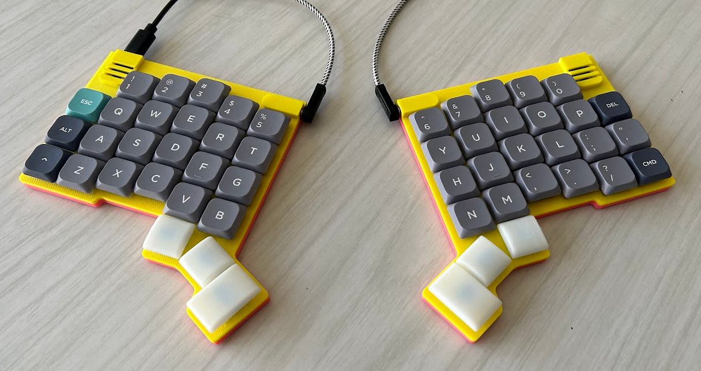
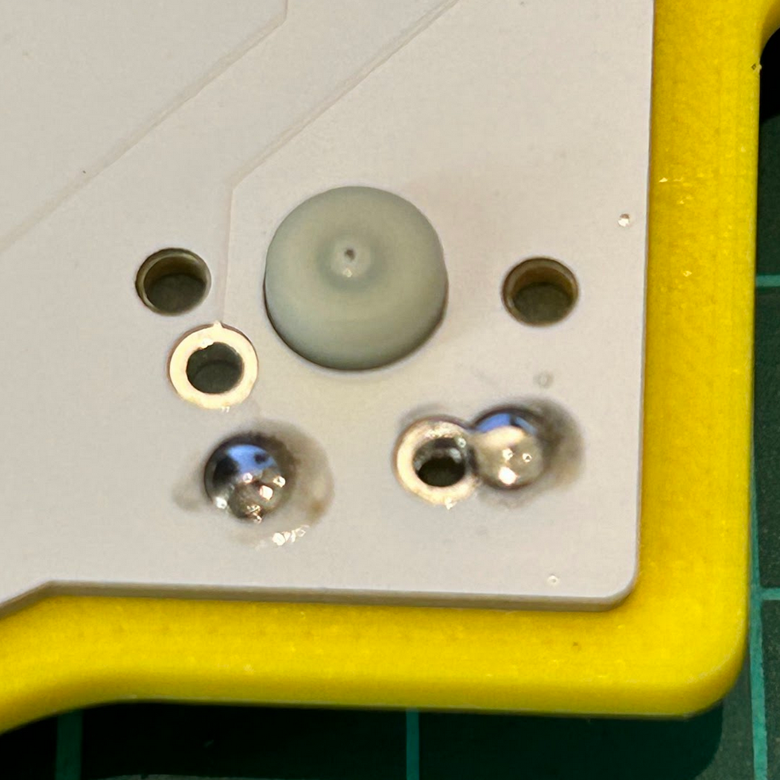

# IK Keyboard

A 52 key, split, low-profile, column staggered keyboard using a Waveshare RP2040 Zero MCU and Gateron KS-33 switches, running QMK.

The layout is similar to the ZSA Voyager, but with the outer top key moved to a third thumb position.

The keyboard is about 16mm high from the table to the top of the keycap when using low-profile keycaps.

A set of printable low-profile thumb keycaps is also included in this repo.

## Part List

- Left and right [PCBs](1.2/gerbers) (1.2mm thickness).
- 3D printed [case](1.2/stls) (4 pieces).
- 52x Gateron KS-33 switches.
- 2x Waveshare RP2040-Zero MCUs.
- 52x 1N4148W SOD123F diodes (SOD123 may work too, though untested).
- 2x SMD TRS jack (SJ-3524-SMT-TR).
- 10x M2 3mm (height) x 3.5mm (diameter) heat set inserts.
- 10x M2 4mm screws.
- 8x 6mm diameter bumpons.
- 50x 1U keycaps. Make sure they're compatible with the low profile switches. Pictured are the Nuphy COAST Twilight nSA keycaps.
- 2x 1.5U keycaps. Pictured are my own design which you can find [here](Keycaps/).
- 1x male-to-male TRS cable, for connecting the halves.
- 1x USB-C cable, for connecting to your computer.

## Build Guide

### Manufacture the PCBs

The Gerbers can be found [here](1.2/gerbers). 

IMPORTANT: They should be 1.2mm thick! Any thicker and they won't fit.
Thinner may work too, but I found 0.6mm would warp, resulting in a twisted case.

The PCBs are not reversable. You'll need separate left and right PCBs.

### Print the case

I recommend printing the case in PLA, because the heat set inserts won't work with resin.
I printed mine using an online service and selected 100% infill.

### Flash the firmware

The firmware can be found [here](https://github.com/ianmaclarty/qmk_firmware/tree/master/keyboards/handwired/ianmaclarty/ik1_2). 

To build it, copy the linked folder to your qmk installation and run the command 
`qmk compile -kb handwired/ianmaclarty/ik1_2 -km default` from the qmk root directory. 

You can flash the MCU by plugging it into your PC and then holding down the boot button while pressing the reset button.
It should then show up as a usb drive and you can drag the `handwired_ianmaclarty_ik1_2_default.uf2` file onto the drive.
Flash both sides with the same firmware.

I recommend testing the MCU before soldering by shorting pins 9 and 7 with it plugged it. This should produce a '1' character.

### Solder the MCU, TRS jack and diodes

All these components go on the top of the board.

Solder the MCU with the buttons facing up. 
The way I did it was to first apply a small blob of solder to one of the pads and 
then slide the MCU into position while keeping the solder wet. Once it was in the 
right position I soldered the remaining pads.

Each diode should have a bar on one side (you may need a magnifying glass to see it). This should be on the same side as 
the bar on the PCB, in the direction of the arrow.
As the diode marking can be very hard to see, I soldered one side of the diodes first and then
tested they were all correctly oriented with a multimeter before soldering the other side.
Make sure the diodes are inside their designated rectangles, otherwise they will interfere with the case.

Solder the TRS jack making sure it's aligned with its designated rectangle.

### Solder the switches

Position the PCB on the top half of the case and push through 4 switches at the corners to support it.

The pins of the switches need to be clipped before soldering so that they're flush with the PCB. You'll need
some flush cutters for this.

 

Apply just enough solder so the hole is filled, but there isn't a noticeable bump. The solder point needs to be
flush with the PCB or it won't fit.

 

Once the PCB is secured with the corner switches, proceed to solder the remaining switches.

### Insert the heat set inserts

I push them in with a soldering iron set to 200C. Do it on a flat surface so you don't get a bulge on the bottom of the case from the melted plastic. Make sure they're flush with the case.

### Final assembly

Screw the case together, apply bumpons, add keycaps and you're done!

### Notes

The USB cable must be plugged into the left half.

You may want to avoid plugging/unplugging the TRS cable while the keyboard is connected to the computer as this may short the MCU (I've not experienced this, but better safe than sorry).

To reflash the firmware you can hold down the top key on the left-most column (ESC in the pictures) while connecting it to the computer. It should then show up as a USB drive.

### Thumb keycaps (optional)

I designed a set of thumb keycaps to go with the board. You can find them [here](Keycaps/). I recommend printing these in resin.

## Known issues

The screw points aren't close enough to the edge of the case and/or there aren't enough of them, resulting
in a small gap between the top and bottom of the case in some places.

## License

IK Keyboard © 2024 by Ian MacLarty is licensed under [CC BY-NC-SA 4.0](http://creativecommons.org/licenses/by-nc-sa/4.0/).