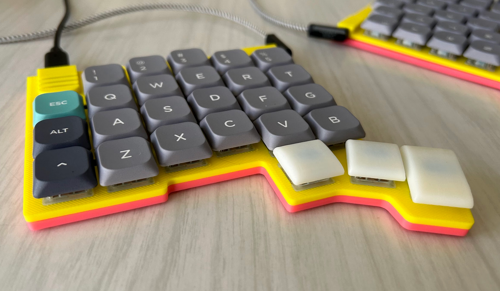
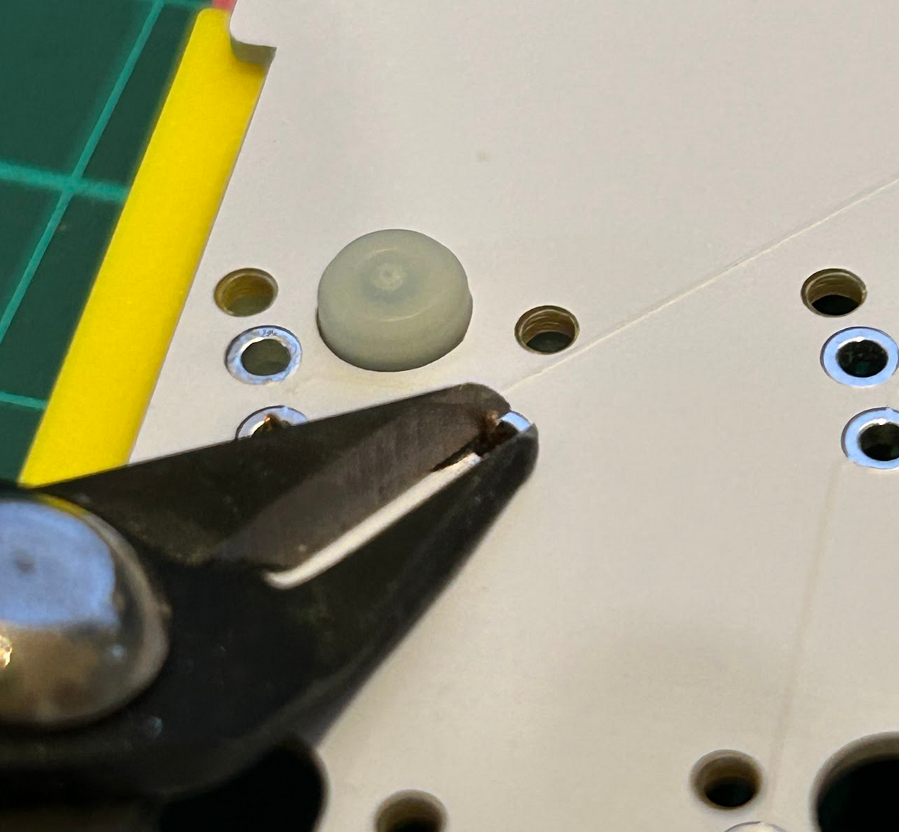
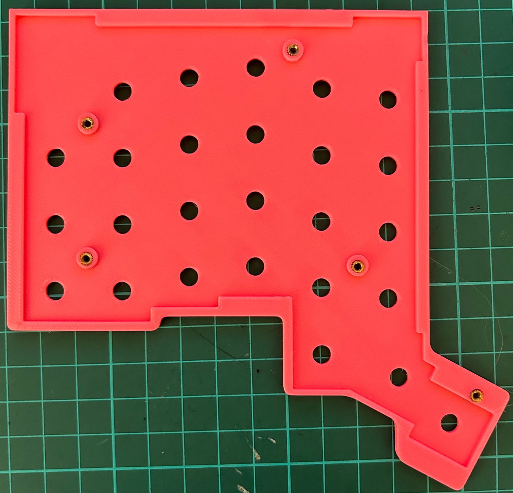

# IK Keyboard

A 52 key, split, low-profile, column staggered keyboard using a Waveshare RP2040 Zero MCU and Gateron KS-33 switches, running QMK.

The layout is similar to the ZSA Voyager, but with the outer top key moved to a third thumb position.

A set of printable thumb keycaps is also included in this repo.

## Bill of Materials

- Left and right [PCBs](1.2/gerbers) (1.2mm thickness)
- 3D Printed [Case](1.2/stls) (4 pieces)
- 52x Gateron KS-33 switches
- 2x Waveshare RP2040-Zero MCUs
- 52x 1N4148W diodes (SOD123F)
- 2x SMD TRS Jack (SJ-3524-SMT-TR)
- 10x M2 3mm (height) x 3.5mm (diameter) heat set inserts
- 10x M2 5mm screws
- 8x 6mm (diameter) x 2mm (height) bumpons

## Build Guide

### Manufacture the PCBs

The Gerbers can be found [here](1.2/gerbers). 

IMPORTANT: They should be 1.2mm thick! Any thicker and they won't fit.
Thinner may work too, but I found 0.6mm would warp, resulting in a twisted case.

The PCBs are not reversable. You'll need separate left and right PCBs.

### Print the case

I recommend printing the case in PLA, because the heat set inserts won't work with resin.
I printed mine using an online service and selected 100% infill.

### Flash the firmware

The firmware can be found [here](https://github.com/ianmaclarty/qmk_firmware/tree/master/keyboards/handwired/ianmaclarty/ik1_2). 
To build it, run the command `qmk compile -kb handwired/ianmaclarty/ik1_2 -km default` from the qmk root directory. 
You can flash it by holding down the boot button while pressing the reset button on the MCU.
It should then show up as a drive on your computer which you can drag the `handwired_ianmaclarty_ik1_2_default.uf2` file onto.

### Solder the MCU, TRS jack and diodes

All these components go on the top of the board.

For the MCU, the way I did it was to first apply a small blob of solder to one of the pads and 
then slide the MCU into position while keeping the solder wet. Once it was in the 
right position I soldered the remaining pads.

Make sure the diodes are correctly oriented and inside their designated rectangles (otherwise they will interfere with the case).

### Solder the switches

Position the PCB on the top half of the case and push through 4 switches at the corners to support it.

The pins of the switches need to be clipped before soldering so that they're flush with the PCB. You'll need
some flush cutters for this.

 

Apply just enough solder so the hole is filled, but there isn't a noticeable bump. The solder point needs to be
flush with the PCB or it won't fit.

 

Once the PCB is secured with the corner switches, proceed to solder the remaining switches.

### Insert the heat set inserts

I push them in with a soldering iron set to 200C. Do it on a flat surface so you don't get a bulge on the bottom of the case from the melted plastic. Make sure the tops are flush with the case.

### Screw the case together

Screw the case together, apply bumpons, add keycaps and you're done!

### Thumb keycaps (optional)

I designed a set of thumb keycaps to go with the board. You can find them [here](Keycaps/). I recommend printing these in resin.

## Known issues

The screw points aren't close enough to the edge of the case and/or there aren't enough of them, resulting
in a thin gap between the top and bottom of the case in some places.
